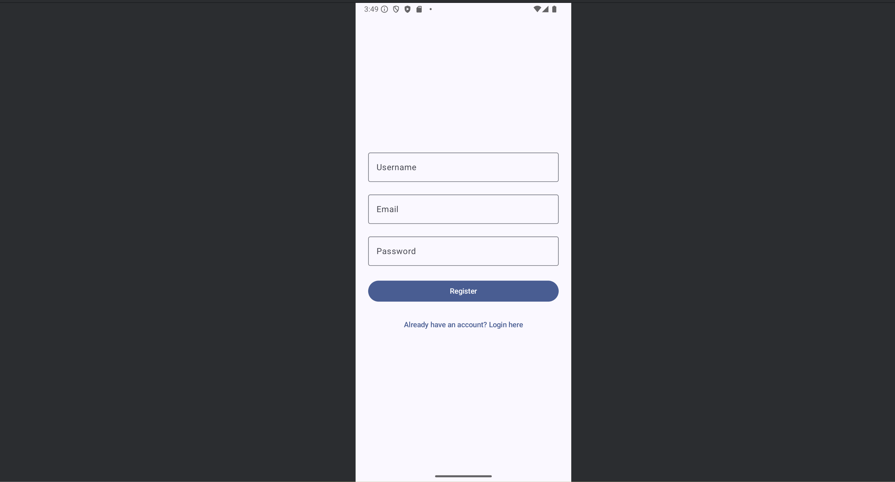
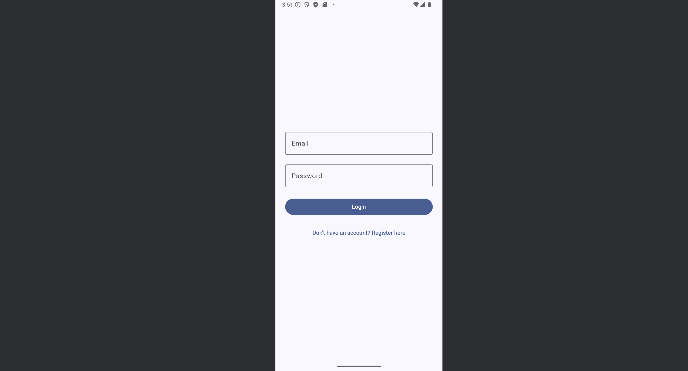
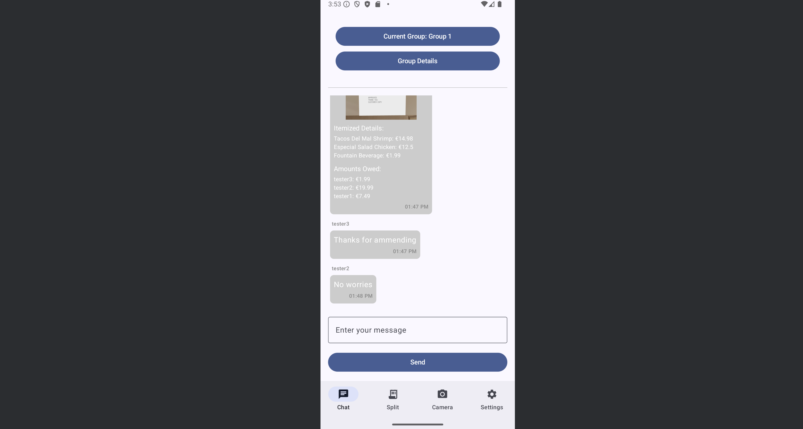
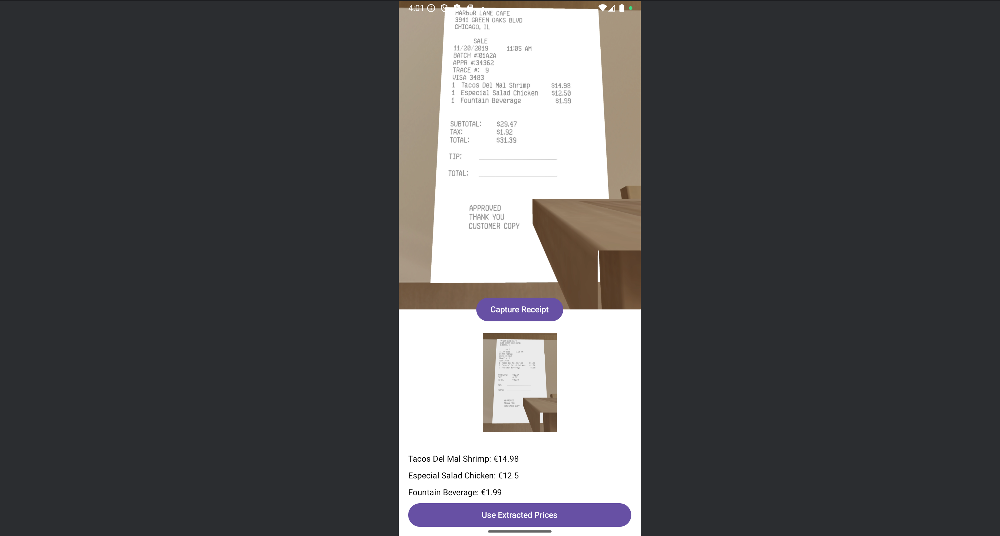
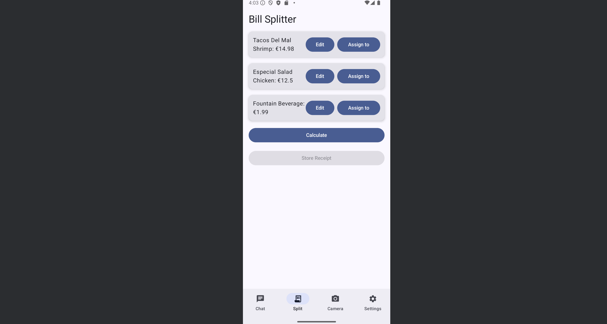
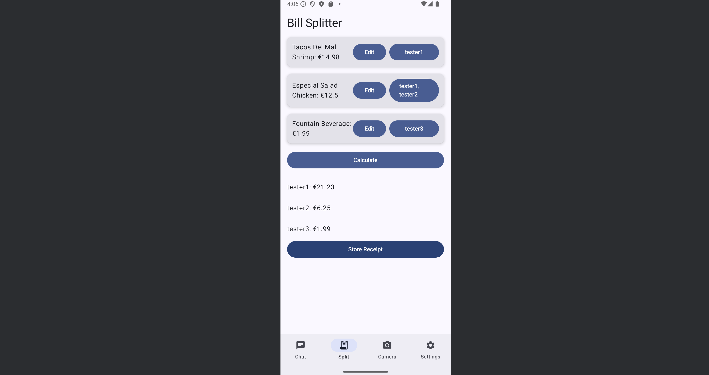

# 📖 **SmartSplit User Manual**

## 📚 **Table of Contents**
1. [Introduction](#1-introduction)
2. [Installation & Setup](#2-installation--setup)
3. [Getting Started](#3-getting-started)
4. [Capturing a Receipt](#4-capturing-a-receipt)
5. [Reviewing and Editing Items](#5-reviewing-and-editing-items)
6. [Splitting the Bill](#6-splitting-the-bill)
7. [Storing and Sharing Receipts](#7-storing-and-sharing-receipts)
8. [Group Chat Features](#8-group-chat-features)
9. [Troubleshooting and FAQs](#9-troubleshooting-and-faqs)
10. [Contact Support](#10-contact-support)

---

## 🟢 **1. Introduction**
Welcome to **SmartSplit**, the ultimate solution for stress-free bill splitting! Whether you're dining out with friends, traveling, or sharing household expenses, SmartSplit helps you capture receipts, extract itemized costs, and fairly split the bill among group members.

This guide walks you through installation, usage, and troubleshooting while highlighting key features of the app.

---

## 📲 **2. Installation & Setup**

### 🔑 **Account Setup**
1. **Sign Up:** Enter your name, email, and password.
2. **Sign In:** If you already have an account, enter your credentials.
3. **Forgot Password?** Tap **Reset Password** to receive recovery instructions.

### 📱 **Permissions**
When prompted, grant the following permissions:
- **Camera Access:** Required to capture receipt images.
- **Notifications:** Recommended for bill updates and group alerts.

💡 *Tip: If you skip permissions, enable them later via your device settings.*

---

## 🚀 **3. Getting Started**
Upon logging in, the **Home Screen** allows you to:
- 📸 Capture a new receipt.
- 📂 View stored receipts.
- 💬 Access group chats for shared expenses.

Tap **Settings** to update your account details or app settings.

💡 *Tip: Turn on notifications for reminders about pending bills.*

---

## 📸 **4. Capturing a Receipt**
1. From the Home Screen, tap **Capture Receipt**.
2. Ensure the receipt is flat, well-lit, and within the camera frame.
3. The app will automatically extract item names and prices using OCR.

💡 *Tip: If the text appears blurry, retake the photo with better lighting.*

---

## 📝 **5. Reviewing and Editing Items**
Once the receipt is processed:
1. **View Extracted Items:** The app displays item names and prices.
2. **Edit Items:** Tap an item to correct spelling, adjust prices, or add missing items.
3. **Confirm and Proceed:** After reviewing, tap **Next** to split the bill.

💡 *Tip: Ensure the total matches the receipt before proceeding.*

---

## 🤝 **6. Splitting the Bill**
1. **Assign Items:** Tap **Assign to** next to each item and select the group member responsible.
2. **Split Evenly:** If everyone shares the bill equally, tap **Split Evenly**.
3. **View Summary:** See how much each person owes based on their assigned items.

💡 *Tip: Use **Split by Percentage** for shared dishes.*

---

## 💾 **7. Storing and Sharing Receipts**
1. Tap **Store Receipt** after splitting the bill.
2. The app saves the receipt image and itemized breakdown.
3. SmartSplit then shares the receipt in the associated group chat.

---

## 💬 **8. Group Chat Features**
SmartSplit simplifies expense coordination:
1. **View Shared Receipts:** In group chat, chat with friends, also view previous receipts.
2. **Real-Time Chat:** Discuss bills, clarify amounts, and confirm payments.
3. **Add Members:** Invite new members via a shared group link.

---

## 🛠 **9. Troubleshooting and FAQs**

### 📸 **OCR Fails to Extract Details:**
- Ensure the receipt is well-lit and fully visible.
- Crop excess background from the image.
- Manually edit items if extraction is incomplete.

### 💥 **App Crashes:**
- Restart the app and check for updates.
- Clear app cache in device settings.

### 👥 **Group Creation Issues:**
- Group names must be UTF-8 characters under 1,500 bytes.
- Ensure all members have internet access when joining.

### 🔑 **Login Issues:**
- Verify your internet connection.
- Reset your password if needed.

